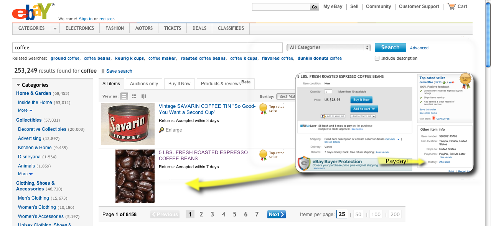

<!SLIDE center bullets incremental transition=fade>
#Wasting Time with Losers

The small business in a commodity market can't waste time on loser products.  

Because of the power law, this means **most** products.

Let's find other people's winners, and start with those!

<!SLIDE center bullets incremental transition=fade>
#eBay, the Egalitarian Market

No "Top Sellers", "Staff Picks" or other favoritism, just vintage 1998 web design.

Fine ground for finding **good selling products**.
