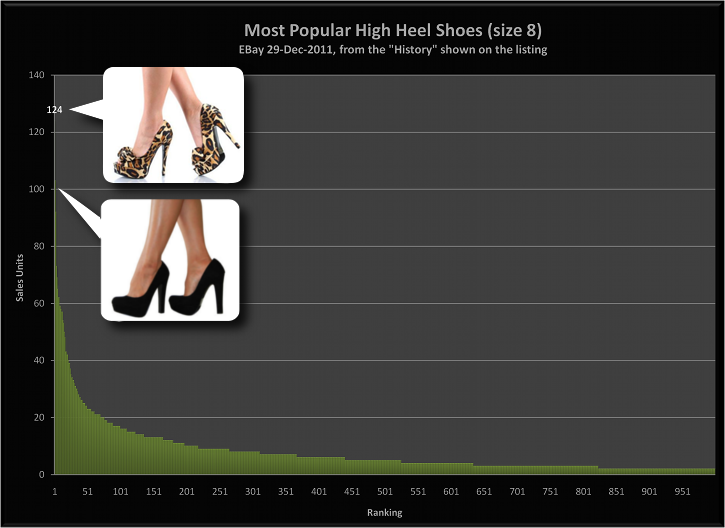
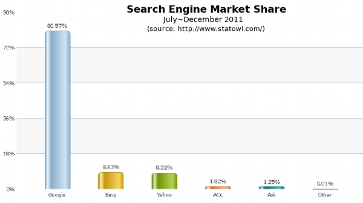

<!SLIDE center bullets incremental transition=fade>
#Pretty Pumps

Stay classy eBay!

<!SLIDE center bullets incremental transition=fade>
#Wasting Time with Losers

The small business in a commodity market can't waste time on loser products.  

Because of the power law, this means **most** products.

Let's find other people's winners, and start with those!

Fine ground for finding **good selling products**.

<!SLIDE center bullets incremental transition=fade>
#Moving Up in the World
That's fine for commodities, but how do I advance my new product in a power law economy? 

Can Bing be the next Google?
